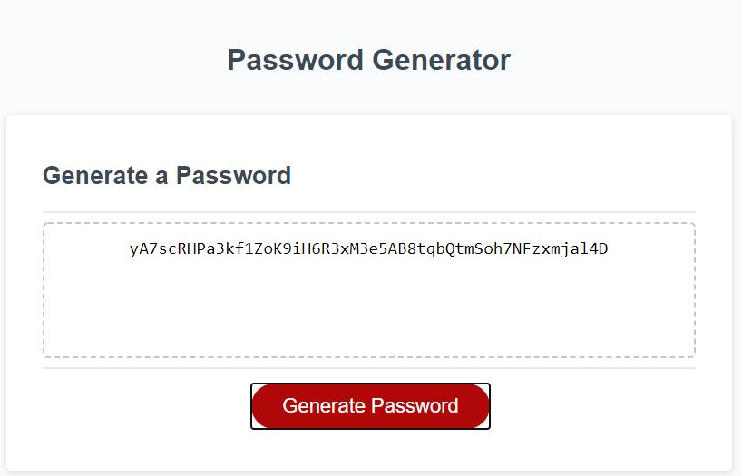

# hw3

Password Generator

This password generator outputs a password according to user's input.
This password generator prevents users from inputing information that is outside of desired character length.

Link to site: https://tdeakin93.github.io/hw3/
